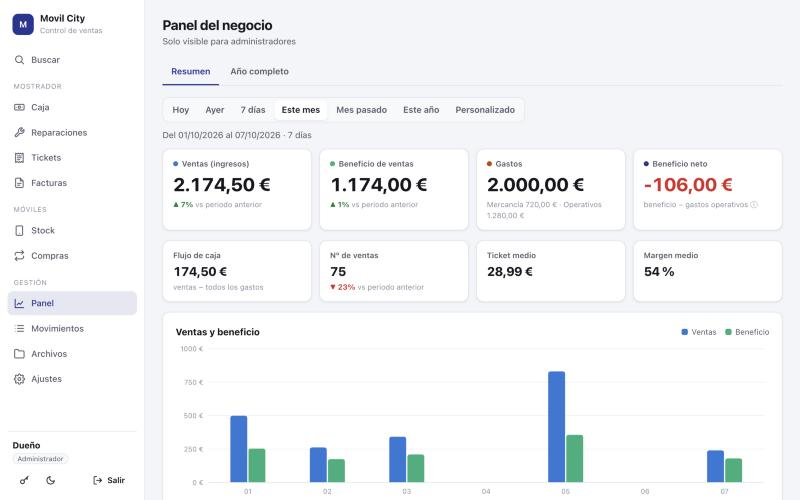
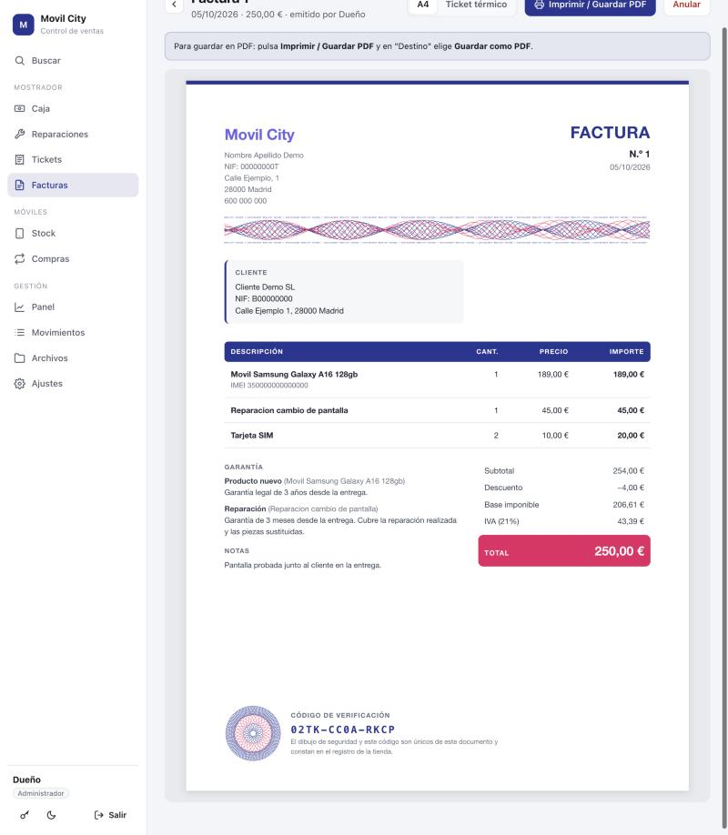
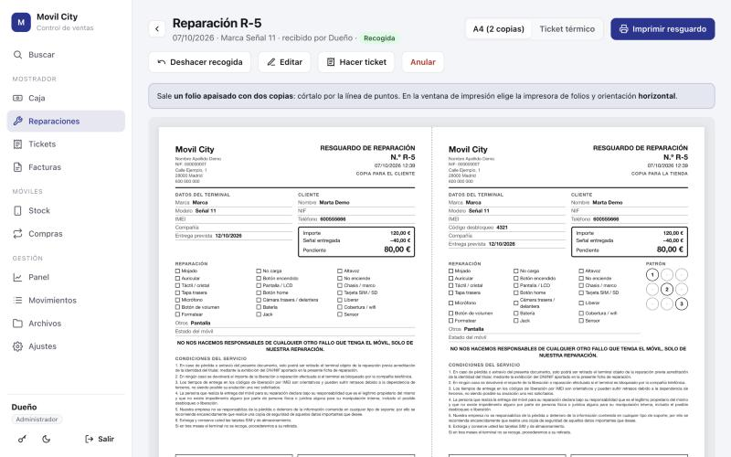

# Movil City · Ventas

Aplicación web para llevar una tienda de telefonía: caja diaria, tickets y facturas, reparaciones, stock de móviles, compras de segunda mano y un panel con los resultados del negocio.

Se instala en un servidor propio (Umbrel, Docker o una Raspberry Pi) y se usa desde el navegador de cualquier ordenador o móvil. No tiene dependencias externas: solo Node.js y un archivo SQLite.



## Contenido

- [Qué incluye](#qué-incluye)
- [Probarla](#probarla)
- [Instalación](#instalación)
- [Usuarios y permisos](#usuarios-y-permisos)
- [Cómo se calcula el beneficio](#cómo-se-calcula-el-beneficio)
- [Documentos verificables](#documentos-verificables)
- [Datos y copias de seguridad](#datos-y-copias-de-seguridad)
- [Avisos legales](#avisos-legales)
- [Desarrollo](#desarrollo)

## Qué incluye

| Sección | Para qué sirve |
|---|---|
| **Caja** | Apuntar ventas y gastos del día en segundos. Se escribe el producto, el precio y el coste o el beneficio; el resto se calcula. |
| **Tickets y facturas** | Factura simplificada (ticket) y factura completa, cada una con su numeración. Garantía por tipo de producto, IVA desglosado opcional y conversión de ticket en factura. |
| **Reparaciones** | Resguardo con los datos del terminal, las averías, la fecha prevista y la señal. Seguimiento *en reparación → lista → recogida*, aviso por WhatsApp y cobro en caja al entregar. |
| **Stock** | Alta de cada móvil con su IMEI y su coste. Al venderlo, el beneficio se calcula solo. |
| **Compras** | Compra de móviles usados a particulares, con contrato para firmar, foto del documento de identidad y registro exportable. |
| **Buscar** | Una sola caja para tickets, facturas, reparaciones, stock y movimientos. También comprueba códigos de verificación. |
| **Panel** | Ventas, beneficio y gastos por día, mes o año, comparados con el periodo anterior. Solo para administradores. |
| **Movimientos** | Historial completo: filtrar, corregir, recuperar borrados y exportar a CSV. |
| **Archivos** | Documentos de la tienda (contratos, albaranes, impuestos) ordenados en carpetas. |
| **Ajustes** | Datos de la tienda, productos, usuarios, permisos, textos de los documentos y copias de seguridad. |

Las secciones que no se usen se desactivan en *Ajustes → Módulos*.

| Factura con dibujo de seguridad | Resguardo de reparación (dos copias) |
|---|---|
|  |  |

## Probarla

Con [Node.js](https://nodejs.org) 22.13 o superior:

```bash
git clone https://github.com/HackDuck3/movilcity-ventas.git
cd movilcity-ventas
npm run demo
```

Abre <http://localhost:3001>. La demo crea dos meses de ventas inventadas en `data-demo/` con dos usuarios: `admin` / `admin123` (administrador) y `trabajador` / `1234`. Para empezar de cero, borra esa carpeta.

## Instalación

| Dónde | Cómo |
|---|---|
| **Umbrel** | Como app de una tienda comunitaria. Guía paso a paso en [INSTALAR-UMBREL.md](INSTALAR-UMBREL.md). |
| **Docker** | `docker compose up -d` con el [docker-compose.yml](docker-compose.yml) del repositorio. Queda en el puerto 4747. |
| **Raspberry Pi OS, Debian o Ubuntu** | `bash install.sh` instala Node.js si falta y crea un servicio que arranca con el sistema (puerto 3000). |
| **Cualquier ordenador** | `npm start` y abrir <http://localhost:3000>. |

La primera vez que se abre, la aplicación pide crear la cuenta del administrador. Después:

1. *Ajustes → Tienda*: nombre, titular, NIF y dirección. Salen en todos los documentos.
2. *Ajustes → Usuarios*: una cuenta por trabajador, para saber quién apunta cada venta.
3. *Ajustes → Tickets y facturas*: prefijos y próximo número de cada serie.

La impresora de tickets en Windows tiene su propia guía: [docs/IMPRESORA.md](docs/IMPRESORA.md).

> La aplicación no cifra la conexión. Úsala dentro de la red local o a través de una VPN; no abras su puerto directamente a internet.

## Usuarios y permisos

Hay dos tipos de cuenta:

- **Administrador**: ve y configura todo.
- **Trabajador**: usa la caja y las secciones que se le permitan. Nunca ve el panel, los movimientos de otros días fuera de su límite ni los archivos.

En *Ajustes → Permisos* se decide qué ve un trabajador (total vendido, beneficio, gastos del día, días de historial) y qué puede hacer (gastos, tickets, reparaciones, compras, y durante cuántos minutos puede corregir sus apuntes).

Los permisos se comprueban en el servidor: un trabajador no recibe los datos que no puede ver, aunque inspeccione el navegador. Los borrados no eliminan nada; quedan marcados con quién y cuándo, y el administrador puede recuperarlos.

## Cómo se calcula el beneficio

Cada venta guarda su precio y su beneficio. Para no restar dos veces el coste de la mercancía, cada motivo de gasto es de uno de dos tipos:

- **Mercancía** (compra de móviles, fundas, recambios): no resta del beneficio neto, porque su coste ya está descontado en el beneficio de cada venta.
- **Operativo** (alquiler, luz, sueldos): sí resta.

| Indicador | Cálculo | Qué indica |
|---|---|---|
| Beneficio de ventas | Suma del beneficio de cada venta | Lo que deja el producto |
| Beneficio neto | Beneficio de ventas − gastos operativos | Lo que gana el negocio |
| Flujo de caja | Ventas − todos los gastos | El dinero que entra o sale |

## Documentos verificables

Cada ticket y cada factura lleva un **código de verificación** de doce caracteres. El servidor lo calcula a partir del número, la fecha, el total y el cliente del documento, con una clave secreta que no sale de él. Sin esa clave no se puede obtener el código de un documento inventado ni el de uno al que se le haya cambiado el importe.

La factura en A4 añade tres elementos dibujados a partir de ese código, distintos en cada documento:

- una **banda de líneas entrelazadas** bajo la cabecera,
- un **sello en roseta** junto al código,
- dos líneas de **microtexto** con el nombre de la tienda, el número y el código, que se leen con lupa en el original y se emborronan al fotocopiarlo.

Para comprobar un documento, escribe su código en **Buscar**: la aplicación muestra la fecha, el total y el cliente que constan en el registro, para compararlos con el papel.

Un papel impreso siempre se puede escanear e imitar a simple vista. Lo que no se puede fabricar es un código válido, así que la prueba de autenticidad es la comprobación del código, no el aspecto.

## Datos y copias de seguridad

Todo se guarda en una carpeta de datos (`data/`, o el volumen `/data` en Docker y Umbrel):

| Ruta | Contenido |
|---|---|
| `ventas.db` | La base de datos: ventas, documentos, reparaciones, stock, ajustes |
| `files/` | Los archivos subidos a la sección Archivos |
| `id-documents/` | Las fotos de documentos de identidad de las compras |
| `backups/` | Una copia diaria de la base de datos; se conservan 30 |

- *Ajustes → Datos y copias* descarga una copia de la base de datos. No incluye `files/` ni `id-documents/`.
- En Umbrel, las copias de seguridad de la app incluyen la carpeta completa.
- *Ajustes → Datos y copias* también exporta los movimientos a CSV e importa ventas y gastos desde un CSV con las columnas `fecha; categoria; importe` (y opcionalmente `tipo`, `beneficio`, `descripcion`, `metodo_pago`).
- Para restaurar: detén la aplicación, sustituye `ventas.db` por la copia, borra `ventas.db-wal` y `ventas.db-shm` si existen y arranca de nuevo.

La carpeta de datos está excluida del repositorio por `.gitignore`.

## Avisos legales

Esta aplicación es una herramienta de gestión. No sustituye al asesoramiento de una gestoría.

- **Facturación**: no es un programa de facturación certificado según el reglamento VeriFactu, cuya entrada en vigor para autónomos está prevista para julio de 2027.
- **IVA**: el régimen aplicable (recargo de equivalencia, bienes usados) cambia lo que debe figurar en una factura. La aplicación permite desglosar o no el IVA, pero no decide cuál corresponde.
- **Compra de objetos usados**: la Ley Orgánica 4/2015, de protección de la seguridad ciudadana, impone obligaciones de registro documental a quien comercia con objetos usados. El registro de compras exportable recoge los datos habituales; el procedimiento concreto lo indica la comisaría correspondiente.
- **Contrato de compraventa y condiciones de reparación**: los textos incluidos son borradores editables, no revisados por un abogado.
- **Datos personales**: la aplicación guarda datos de clientes y vendedores, incluidas fotos de documentos de identidad. Quien la usa es responsable de su tratamiento.

## Desarrollo

```
server.js        Servidor HTTP
src/             Base de datos, autenticación y rutas de la API (una por área en src/routes/)
public/          Aplicación web: JavaScript sin framework ni compilación
scripts/         Datos de demostración, cambio de contraseña y publicación de versiones
test/            Prueba de la API de principio a fin
atik-movilcity/  Paquete para la tienda comunitaria de Umbrel
docs/            Guías
```

```bash
npm run demo     # aplicación con datos de ejemplo
npm test         # recorre los flujos principales contra una base de datos temporal
```

[docs/ARQUITECTURA.md](docs/ARQUITECTURA.md) explica cómo está organizado el código, cómo viaja una petición, el modelo de datos y dónde tocar para cada tipo de cambio.

Para publicar una versión: `bash scripts/release.sh 1.6.0`. El script ejecuta las pruebas, actualiza el número de versión, crea la etiqueta y la sube; GitHub Actions construye la imagen Docker y Umbrel ofrece la actualización.

Si se olvida la contraseña del administrador: `node scripts/reset-password.js <usuario> <nueva-contraseña>`.

## Licencia

Sin licencia de código abierto. Todos los derechos reservados.
